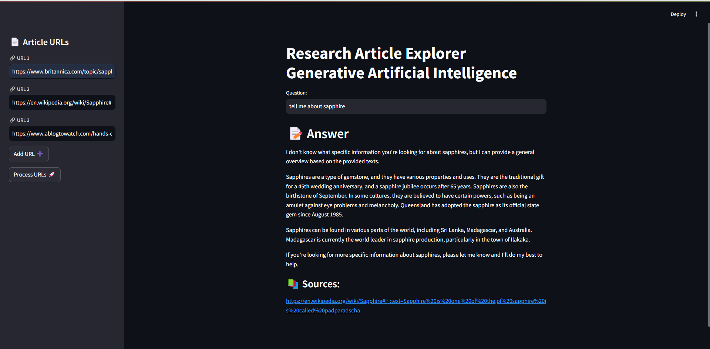

🔍 Research Article Explorer Generative Artificial Intelligence

This Streamlit application allows users to input URLs of research articles, process them, and ask questions about the content of the articles. The application uses the LangChain library for loading, processing, and embedding text data, and integrates with Hugging Face models for embedding generation.

## Features

- Input up to three article URLs.
- Process and embed the content of the articles.
- Ask questions about the content and get answers with sources.
- Beautiful loader and emojis for an engaging user experience.

## Screenshot

